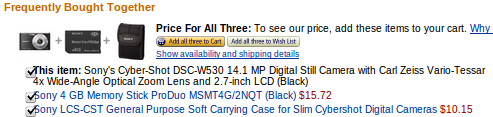
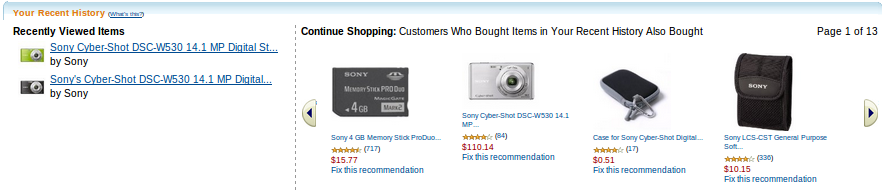

推荐
================

导入已有的数据
----------------

一些电子商务网站可能已经有了用户、商品和订单的数据。这些已有的数据可以以SCD文件的形式被加载到我们的推荐系统。
在SCD文件被放到它们所对应的路径里之后，必须要调用index() API来将它们加载入推荐系统。

用户和商品
----------------

每当用户和商品数据有任何变化，你需要调用下面的API。这些数据在SF1中被存储为文档。文档API中的DOCID就是推荐API中的ITEMID。

============  ============ ============ ============ ============
   Table           Add        Update       Remove        Get
============  ============ ============ ============ ============
   user         add_user   update_user  remove_user    get_user
item = doc       create       update       destroy       get
============  ============ ============ ============ ============

用户行为
----------------

各种用户行为被用来帮助我们的系统为每个用户推荐个性化的结果。

访问商品
~~~~~~~~~~~~~~~~

每当一个用户访问了一个商品（也即这个用户浏览了商品所在的网页），需要调用visit_item API。

这被用于VAV和BOB推荐类型。

购物篮
~~~~~~~~

每当一个用户的购物篮被改变了，例如

* 用户在购物篮里添加或者删除了某商品。
* 用户的购物篮因为订单提交了而变为空。

在上述的情况下，需要调用update_shopping_cart API。

这被用于BOS和BOE推荐类型。

购买商品
~~~~~~~~

每当用户提交一个订单，需要调用purchase_item API。

这被用于BOE推荐类型。

用户偏好
~~~~~~~~

每当用户对某商品表示了偏好，需要调用track_event API。

这被用于BOE推荐类型。

在collection配置文件中，你可以添加任何偏好类型到<RecommendBundle><Schema><Track>。
比如，以下是config/example.xml中配置的4种偏好类型。

* wish_list：用户他的wish list添加了一个商品
* own：用户已经拥有了某商品
* like：用户喜欢某个商品
* favorite：用户把某个商品加入到“最爱”中。

以下事件类型是默认支持的，它们被用来剔除商品：

* not_rec_result：用户对某商品不感兴趣，所以我们的推荐系统将不会对此用户推荐这件商品。
* not_rec_input：用户不想让某件商品被用来向他做推荐，所以我们的推荐系统将不会在对此用户推荐的决策中使用这件商品。

评价商品
~~~~~~~~

每当用户对一个商品评分，需要调用rate_item API。

这被用于BOE推荐类型。

评分分为1、2、3、4、5五个等级。他们的意义如下：

* 1、我讨厌它
* 2、我不喜欢它
* 3、它还可以
* 4、我喜欢它
* 5、我爱死它了

推荐API图文介绍
----------------

通过使用我们的推荐API，可以实时的上传数据并且获得推荐结果，相应的API接口参看
:doc:`../../API/recommend/API`

do_recommend API支持7种推荐类型。你可能已经在一些电子商务网站使用过它们，如Amazon.

FBT(Frequently Bought Together)
~~~~~~~~~~~~~~~~~~~~~~~~~~~~~~~~~~~~~~~~

它通常给出了在一个订单中通常与输入商品一起购买的商品。

例如，给定如下的输入商品：

系统推荐了另外的2件商品：

BAB(Bought Also Bought)
~~~~~~~~~~~~~~~~~~~~~~~~~~~~~~~~

它给出了通常用户买了输入商品时还买了哪些商品。

例如：

VAV(Viewed Also View)
~~~~~~~~~~~~~~~~~~~~~~~~

它给出了通常用户看了输入商品时还看了哪些商品。

BOE(Based On Event)
~~~~~~~~~~~~~~~~~~~~~~~~

它根据除了查看商品外的用户行为给出推荐的商品，因为查看商品的行为专门用于BOB推荐类型。

例如：

在上面的例子中，有一个名为"Fix this recommendation"的链接，它链向类似如下的内容：

它给出了系统推荐这些商品的原因。do_recommend API也返回了包含reasons的结果。

基于这些原因，用户可以给出更多的偏好和评分来改善推荐系统。

BOB(Based on Browse History)
~~~~~~~~~~~~~~~~~~~~~~~~~~~~~~~~

它基于用户的浏览历史给出了推荐的商品。

例如：

BOS(Based on Shopping Cart)
~~~~~~~~~~~~~~~~~~~~~~~~~~~~~~~~

它基于用户的购物篮给出了推荐的商品。

例如：

TIB(Top Item Bundle)
~~~~~~~~~~~~~~~~~~~~~~~~

top_item_bundle API是第7种推荐类型。
它给出了在一个订单里，哪些商品被购买得最频繁，也即最畅销的商品系列。

配置文件
--------

在config/sf1config.xml中，可以配置如下选项：

* CollectionDataDirectory配置推荐数据的路径。
* CronPara配置推荐任务的定时执行。
* 在CacheSize中， 为了针对do_recommend() API获得更好的性能，可以为以下cache配置更大的容量：
  purchase配置购买矩阵的cache容量，在rec_type是BAB，BOE，BOB和BOS时使用；
  visit配置访问矩阵的cache容量，在rec_type是VAV时使用；
  index配置索引缓冲的容量，在rec_type是FBT时使用。

下面是一个默认的配置，你可以根据自己的需求修改：

::

    <RecommendBundle>
      <Parameter>
        <CollectionDataDirectory>default-recommend-dir</CollectionDataDirectory>
        <CronPara value="0 0 * * *" />
        <!-- 1G for purchase matrix, 512M for visit matrix, 10M for index buffer -->
        <CacheSize purchase="1073741824" visit="536870912" index="10485760" />
        <FreqItemSet enable="no" minfreq="10" />
      </Parameter>
    </RecommendBundle>

在collection配置文件中，比如config/example.xml，可以配置以下选项：

* DocumentSchema配置商品的属性。DOCID属性在所有的推荐API中被称为ITEMID。
* User配置用户的属性。
* Track配置用户事件的属性，用于track_event()和do_recommend() API。

下面是一个默认的配置，你可以根据自己的需求修改：

::

    <DocumentSchema>
      <Property name="DOCID" type="string"/>
      <Property name="DATE" type="string"/>
      <Property name="Title" type="string"/>
      <Property name="Content" type="string"/>
      <Property name="URL" type="string"/>
    </DocumentSchema>

    <RecommendBundle>
      <Schema>
        <User>
          <Property name="gender" />
          <Property name="age" />
          <Property name="area" />
        </User>
        <Track>
          <Event name="wish_list" />
          <Event name="own" />
          <Event name="like" />
          <Event name="favorite" />
        </Track>
      </Schema>
    </RecommendBundle>

SCD格式
--------

有3种SCD类型：index，user，order
在SCD文件被放到它们对应的目录下之后，你需要调用index() API去把它们加载入SF1系统。

index SCD
~~~~~~~~~~~~~~~~

* index SCD不仅用于推荐任务中的item数据，也用于SF1中的搜索和数据挖掘任务。
* 它包含商品的数据。
* DOCID域对于每个商品项都是必需的，它就是order SCD和所有推荐API中的ITEMID。

目录：collection/example/scd/index

例如：

::
    
    <DOCID>item_001
    <Title>iphone
    <Content>digital device
    <URL>www.shop.com/product/item_001

user SCD
~~~~~~~~~~~~~~~~

它包含用户的配置数据。USERID对于每个用户都是必需的。

目录：collection/example/scd/recommend/user

例如：

::

    <USERID>user_001
    <gender>male
    <age>23
    <area>Beijing

order SCD
~~~~~~~~~~~~~~~~

* 它包含购买的数据。
* USERID和ITEMID对于每个记录都是必需的。
* ORDERID代表订单id。如果缺省，这条记录将被视为一条新的记录。
* 如果多个记录的ORDERID是一致的，那么这些记录将被合并视为一个订单。
* DATE域的格式是"YYYY-mm-dd"。如果缺省，当前的时间将会被使用。

目录：collection/example/scd/recommend/order

例如：

::

    <USERID>user_001
    <ITEMID>item_001
    <ORDERID>order_001
    <DATE>2011-04-11
    <price>3000
    <quantity>1

分布式部署
------------

可以将SF1服务部署在多台机器上，以下是最经常使用的用例。

一台机器上
~~~~~~~~~~~~~~~~

以下是默认的配置，只有一台机器运行搜索和推荐服务。

在example.xml中：

::

    <Collection ...>
      <DocumentSchema> ...
      <IndexBundle> ...
      <MiningBundle> ...
      <RecommendBundle>...
    </Collection>

在sf1config.xml中：

::

    <SF1Config ...>
      <Deployment>...
        <DistributedTopology enable="n" type="search" ...>
        <DistributedTopology enable="n" type="recommend" ...>
      </Deployment>
    </SF1Config>

搜索和推荐主控在同一台机器上
~~~~~~~~~~~~~~~~~~~~~~~~~~~~~~~~~~~~~~~~~~~~~~~~~~~~~~~~

以下是一个在A机器上运行搜索服务，在A和B上运行推荐服务的例子，

* A机器作为单个的搜索节点
* A机器作为推荐主控和1号worker
* B机器作为推荐2号worker

A机器上的example.xml：

::

    <Collection ...>
      <DocumentSchema> ...
      <IndexBundle> ...
      <MiningBundle> ...
      <RecommendBundle>...
    </Collection>

A机器上的sf1config.xml:

::

    <SF1Config ...>
      <Deployment>
        ...
        <DistributedCommon clusterid="cluster_001" ... />

        <DistributedTopology enable="n" type="search" nodenum="2">
          <CurrentSf1rNode nodeid="1" replicaid="1">
            <MasterServer enable="y" name="undefined" shardnum="2">
              <Collection name="example" distributive="y"/>
            </MasterServer>

            <WorkerServer enable="y" shardid="1">
              <Collection name="example"/>
            </WorkerServer>
          </CurrentSf1rNode>
        </DistributedTopology>

        <DistributedTopology enable="y" type="recommend" nodenum="2">
          <CurrentSf1rNode nodeid="1" replicaid="1">
            <MasterServer enable="y" name="undefined" shardnum="2">
              <Collection name="example" distributive="y" shardids="1,2"/>
            </MasterServer>

            <WorkerServer enable="y" shardid="1">
              <Collection name="example"/>
            </WorkerServer>
          </CurrentSf1rNode>
        </DistributedTopology>
        ...
      </Deployment>
    </SF1Config>

B机器上的example.xml:

::

    <Collection ...>
      <DocumentSchema> ...
      <RecommendBundle>...
    </Collection>

B机器上的sf1config.xml:

::

    <SF1Config ...>
      <Deployment>
        ...
        <DistributedCommon clusterid="cluster_001" ... />

        <DistributedTopology enable="n" type="search" nodenum="2">
          <CurrentSf1rNode nodeid="1" replicaid="1">
            <MasterServer enable="y" name="undefined" shardnum="2">
              <Collection name="example" distributive="y"/>
            </MasterServer>

            <WorkerServer enable="y" shardid="1">
              <Collection name="example"/>
            </WorkerServer>
          </CurrentSf1rNode>
        </DistributedTopology>

        <DistributedTopology enable="y" type="recommend" nodenum="2">
          <CurrentSf1rNode nodeid="2" replicaid="1">
            <MasterServer enable="n" name="undefined" shardnum="2">
              <Collection name="example" distributive="y" shardids="1,2"/>
            </MasterServer>

            <WorkerServer enable="y" shardid="2">
              <Collection name="example"/>
            </WorkerServer>
          </CurrentSf1rNode>
        </DistributedTopology>
        ...
      </Deployment>
    </SF1Config>

搜索和推荐主控在不同的机器上
~~~~~~~~~~~~~~~~~~~~~~~~~~~~~~~~~~~~~~~~~~~~~~~~~~~~~~~~

以下是一个在A机器上运行搜索服务，在B和C上运行推荐服务的例子，

* A机器作为搜索主控和worker
* B机器作为推荐主控和1号worker
* C机器作为推荐2号worker

A机器上的example.xml：

::

    <Collection ...>
      <DocumentSchema> ...
      <IndexBundle> ...
      <MiningBundle> ...
    </Collection>

A机器上的sf1config.xml:

::

    <SF1Config ...>
      <Deployment>
        ...
        <DistributedCommon clusterid="cluster_001" ... />

        <DistributedTopology enable="y" type="search" nodenum="2">
          <CurrentSf1rNode nodeid="1" replicaid="1">
            <MasterServer enable="y" name="undefined" shardnum="2">
              <Collection name="example" distributive="y"/>
            </MasterServer>

            <WorkerServer enable="y" shardid="1">
              <Collection name="example"/>
            </WorkerServer>
          </CurrentSf1rNode>
        </DistributedTopology>

        <DistributedTopology enable="n" type="recommend" nodenum="2">
          ...
        </DistributedTopology>
        ...
      </Deployment>
    </SF1Config>

B机器上的example.xml:

::

    <Collection ...>
      <DocumentSchema> ...
      <RecommendBundle> ...
    </Collection>

B机器上的sf1config.xml:

::

    <SF1Config ...>
      <Deployment>
        ...
        <DistributedCommon clusterid="cluster_001" ... />

        <DistributedTopology enable="n" type="search" nodenum="2">
          ...
        </DistributedTopology>

        <DistributedTopology enable="y" type="recommend" nodenum="2">
          <CurrentSf1rNode nodeid="1" replicaid="1">
            <MasterServer enable="y" name="undefined" shardnum="2">
              <Collection name="example" distributive="y" shardids="1,2"/>
            </MasterServer>

            <WorkerServer enable="y" shardid="1">
              <Collection name="example"/>
            </WorkerServer>
          </CurrentSf1rNode>
        </DistributedTopology>

        ...
      </Deployment>
    </SF1Config>

C机器上的example.xml:

::

    <Collection ...>
      <DocumentSchema> ...
      <RecommendBundle> ...
    </Collection>

C机器上的sf1config.xml:

::

    <SF1Config ...>
      <Deployment>
        ...
        <DistributedCommon clusterid="cluster_001" ... />

        <DistributedTopology enable="n" type="search" nodenum="2">
          ...
        </DistributedTopology>

        <DistributedTopology enable="y" type="recommend" nodenum="2">
          <CurrentSf1rNode nodeid="1" replicaid="1">
            <MasterServer enable="n" name="undefined" shardnum="2">
              <Collection name="example" distributive="y" shardids="1,2"/>
            </MasterServer>

            <WorkerServer enable="y" shardid="2">
              <Collection name="example"/>
            </WorkerServer>
          </CurrentSf1rNode>
        </DistributedTopology>

        ...
      </Deployment>
    </SF1Config>
